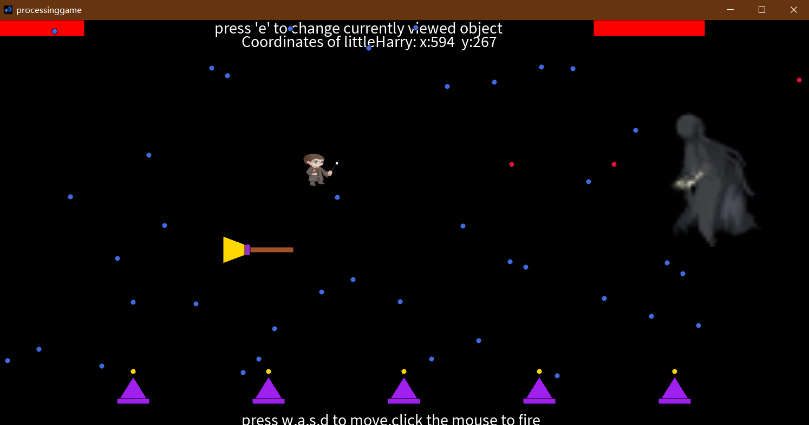

# Stack-based Push and Pop 2D Transformation Matrix

## ABSTRUCT
This project is developed with **Processing**. In this **2D** game, you could play the role as Harry Potter using his magical wand to fight with the evil monster who uses magic. Overall, it's more like a '**barrage**'. It's also a paper submitted as a course design to my college.

<center></center>
<br>

## UML Design
### Class Diagram
<center></center>
<br>

### Use Case Diagram
<center></center>


It’s obvious that many classes are related to **CoordinateSystem**. because it’s one of the most important class in this project, every child class inheriting from it will have its own **2D** coordinates and three member variables which are **activated:boolean** for garbage collection, **radius:int** for represent collision volume and **images:ArrayList<PImage>** to store **.png** for itself.    

Now  **CoordinateSystem** has created a **2D** space for other objects, we can introduce the main characters: Harry Potter and his enemy, each inheriting from **Human** and **Monster**. Also, these two classes inherit from **Creature**. I also added an interface **Movement** that contains method **move( )**  so that every object implements the interface will be able to move in specific way, meaning that, they will reveal different action in the following frame (move 3 units alongside the **X** **axis** or just change its shape). 

Since objects in the coordinate system can make movements now, I tried to design the most interesting part of this game: the fight between monster and Harry. So I have designed **Bullet**, as a class from which **FireBullet** and **IceBullet** derives. The fire bullet is fired by the human and the ice bullet is fired by the monster,  they also inherit from **Coordinate System**, so every fired bullet would initiate an instance in memory. The bullet fired also has its damage. When the bullet is judged to hit its target, the damage will be calculated in real-time through checking the bullet’s class type. 

After I’ve done the main structure of the game, as the document’s content request, I should add at least one object to the game using the **Pop and Push Stack**. So, I design a new class **Environment** from which the **MagicalBroom** and the **MagicHat** derives. By using the **Pop and Push Stack**, we could create a composite object with several separate object. For example, here is the code of the **move()** in **MagicalBroom:**

```java
    void move(){
        pushMatrix();
            if(this.x>1370||this.x<130){
            speed = -speed;
            rotate(PI);   
        }
        // draw tail
        fill(#FFD700);
        quad(this.x, this.y, this.x + 40, this.y + 15, 
        	this.x + 40, this.y + 35, this.x, this.y + 50);
        // draw ring
        fill(#9932CC);
        rect(this.x + 40, this.y + 15,10,20);
        // draw the stick
        fill(#A0522D);
        rect(this.x + 50,this.y + 20,80,10);
        this.x += speed;
        translate(this.x, this.y);
        popMatrix();
    } 
```

There are also two vital class I design  for maintaining game mechanism: **Statement** and **Counter**. The former one is set as a global variable controlling the whole game process.  **Counter** will be used in the control part of the **Creature**'s fire rate in order not to break the balance of the game. 

## More Details of  The Code
### Initiation

Before the game starts, **setup( )** will initiate the size of the window. I also put lots of declarations on the top so that they can be ‘**global**’  and built a basic frame for game running in. The images are also loaded in the initiation part. For example, I have declared a **static int[ ]** array to initiate the magic hats’ location. 

```java
	ArrayList<CoordinateSystem> movingObjs = new ArrayList<CoordinateSystem>();
	ArrayList<Counter>  counters = new ArrayList<Counter>();
	Statement fireRateLimit = new Statement(false);// Control Harry's FireRate
	Statement monster_FireRate = new Statement(false);// control monster's FireRate
	Creature littleHarry = new Human(500,30,30,40);
	Creature monster = new Monster(1500,1300,300,150);
	HeathPointStrip harryHealth = new HeathPointStrip(0,0,0);
	HeathPointStrip monsterHealth = new HeathPointStrip(1100,0,0);
	MagicalBroom mb = new MagicalBroom(400,400,0);
	int[] posOfMagicHatsX = new int[]{250,500,750,1000,1250};
	ArrayList<Integer> doubleHitTimes = new ArrayList<>();
	int currDoubleCount = 0;
	boolean isDoubleHit = false;
	boolean isGameEnd = false;
	int resultJudge = 0;
```


### Movement of  The object

All the objects deriving from the **CoordinateSystem** are added to a dynamic array list. Every time after the frame refreshes, there will be one iteration in the array list to invoke each objects’ **move( )** and make them move in their specific way defined in their own **move( )** function. If the objects move out of the boundary, they will be marked as inactivated or be limited in the boundary.  

### Garbage collection

As the same above, there will be also an iteration each time the frame refreshes to clear (set the image’s coordinate out of the boundary like (5000,5000)) the objects that are marked inactivated.  

```java
    // delete the trash among moving Objects
    ArrayList<Integer> trashList = new ArrayList();
	for (int i = 0;i < movingObjs.size();++i) {
        CoordinateSystem cs = movingObjs.get(i);
        if (!cs.activated) {
            trashList.add(i);
        } else{
            cs.move();	
        }
    }
```

### Game status

As the game goes on, the game status part code will continuously check the health points of the monster and the littleHarry to give the result of the game in a suitable time. 

### Appearance 

The main characters are displayed with **.png** format image while the others objects are all drawn by **Processing** code. In this game, you will see a  magic broom flying alongside the **x axis** and five magic hat placed at the bottom of the window. There are also two health points strip hang on the left and right corner displaying the current health points of the monster and littleHarry. Subsequently, littleHarry flies through great amounts of dangerous bullets fighting with his enemy. And I added a detail to the harry’s arm: while firing, he will put up his arm and then put down it to finish a set of actions.

### Interactions

Press **“W, A, S, D”** to transform the littleHarry and click the mouse to fire. Press **‘E’** to switch the current checked object ‘s coordinates. (The magic broom and the littleHarry) .

## Summary
  Through this project, I understand that animation is achieved by the fast change of frames and it’s really sticky to make every object in the area move properly as I expected. When I tried to load my **.png** image on the **Bullet** objects, I found that only a small amount of **Bullet** instances (40 on my laptop, Each has the size of only 112 **KB**) could bring a huge burden to the **PC**).

## Tips
   run **.pde** source file in **/src** folder. 

## Author
  Wrote by azusaings@gmail.com - 2021/10/26
  UI Source by Mercurii@music.163.com -2021/10/26
  Revised by azusaings@gmail.com - 2023/5/23
